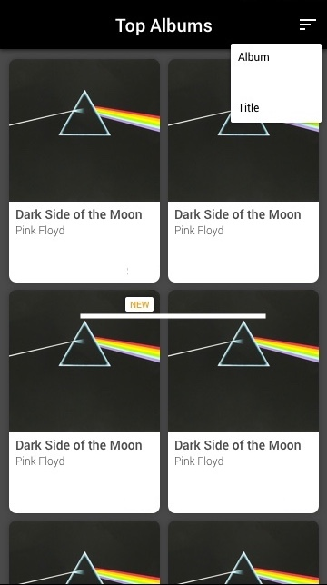

# weecare-ios-challenge

A client has an idea for an application but all that's been provided is the following description and mockup:

```
I want an app where you can see the best music albums from iTunes. It 
should have a modern design. They should also be able to sort the albums.
I tried to make the app myself but I am too busy. Recently released albums 
should also be noted. Thanks.

For reference here is the api we are using: https://rss.itunes.apple.com/en-us
```


Your task is to checkout the provided code and provide a submission that accomplishes the features the client is requesting. Beyond the functional requirements, we will also be considering the following areas (among others) of code quality:

- Architectures & Frameworks
- SOLID Principles
- File Structure
- Naming Conventions
- Bugfixes & Improvements
- Testing

If you have any questions, don't hesitate to email them to your contact at WeeCare. Treat this task as an opportunity to showcase your iOS, engineering, and design strengths. If you want to incorporate a design pattern or multi-module project, go for it! Similarly, if you see a compelling case for more functionality or a more refined design, go ahead and make those improvements. At the same time, we understand you're busy and expect no more than few hours spent on this submission.
